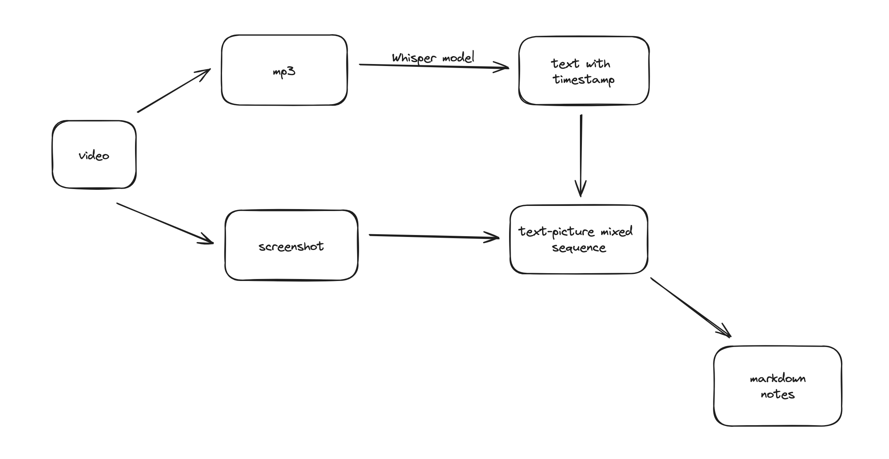

# video_to_notes

In order to improve efficiency of learning video courses myself, I created this project.

## Main purpose

The main purpose of this tool is:

- Convert a video into a **verbatim manuscript mixed with screenshots**, and store it as a **markdown document**.

### Technical route

and, ⚠️ please remember using GPU to perform video-to-text transformation.. 
